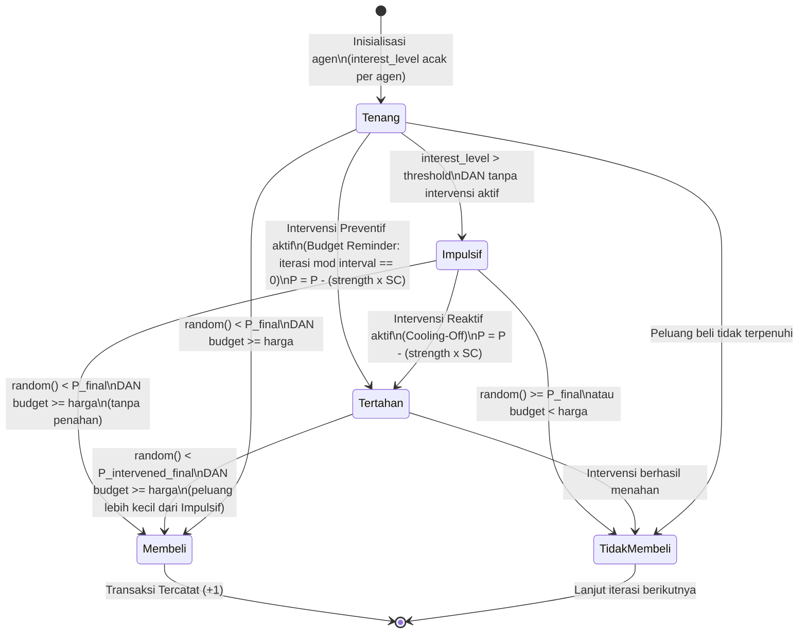

# Simulasi Perilaku Pembelian Pelanggan pada E-Commerce dengan Agent-Based Modeling (ABM)

## Identitas Proyek Akademik
- **Nama Mahasiswa:** Muhammad Iqbal Fadel
- **NIM:** 202310370311268
- **Mata Kuliah:** Pemodelan dan Simulasi Data
- **Kelas:** D
- **Dosen Pengampu:** Vinna Rahmayanti S, S.Si., M.Si.
- **Topik Proyek:** Agent-Based Modeling (ABM) untuk Simulasi Perilaku Pembelian Pelanggan pada E-Commerce

---

## Deskripsi Singkat
Proyek ini mengimplementasikan sistem simulasi berbasis agen (Agent-Based Modeling) untuk memodelkan perilaku pembelian pelanggan dalam lingkungan e-commerce. Simulasi ini menganalisis dampak diskon, mekanisme intervensi penahan impulsivitas, dan perbandingan empat skenario what-if terhadap volume transaksi. Proyek ini disusun sebagai pemenuhan Tugas Akhir praktikum mata kuliah Pemodelan dan Simulasi Data semester 6.

## Latar Belakang
Dalam ekosistem e-commerce, perilaku pembelian pelanggan adalah faktor kunci dalam mengoptimalkan strategi penjualan. Namun, perilaku konsumen secara agregat tidak sekadar akumulasi dari individu yang identik, melainkan hasil interaksi dinamis dari berbagai faktor kognitif dan situasional masing-masing pelanggan.

Pendekatan Agent-Based Modeling (ABM) sangat relevan untuk memodelkan sistem yang kompleks ini. Dengan merepresentasikan setiap pelanggan sebagai agen otonom yang memiliki aturan pengambilan keputusannya sendiri, kita dapat mengamati pola perilaku kolektif yang muncul secara natural dari interaksi agen dengan lingkungannya.

## Tujuan Simulasi
1. Mengimplementasikan model matematika probabilitas dalam logika keputusan agen pelanggan.
2. Mensimulasikan dampak tingkat diskon (Discount Rate) dan mekanisme intervensi terhadap probabilitas pembelian.
3. Membandingkan volume transaksi pada empat skenario kondisi berbeda (Baseline, Reaktif, Preventif, Distorsi Tinggi) melalui simulasi stokastik Monte Carlo.

## Metode yang Digunakan

### 1. Agent-Based Modeling (ABM)
ABM digunakan untuk memodelkan pelanggan secara individu (mikro) dengan sekumpulan atribut dan aturan keputusan (rules). Setiap agen berperilaku secara otonom dan heterogen — atributnya diinisialisasi secara acak sehingga tiap agen mewakili profil pelanggan yang unik.

### 2. Monte Carlo Simulation
Karena pengambilan keputusan pembelian pada tingkat agen bersifat stokastik, simulasi ini menggunakan metode Monte Carlo dengan 1000 iterasi (default) untuk menghasilkan distribusi agregat yang stabil dan mendekati nilai probabilitas teoretis.

---

## Struktur Agent dan Variabel Simulasi

### Atribut Agent (Pelanggan)
Setiap agen dalam simulasi diinisialisasi dengan atribut independen berikut:
- **Purchase Probability (P):** Probabilitas dasar (baseline) pelanggan untuk melakukan pembelian [0.1 - 0.5].
- **Interest Level (I):** Tingkat ketertarikan pelanggan terhadap produk [0.0 - 1.0].
- **Budget (B):** Anggaran maksimal yang dimiliki pelanggan [50 - 500].
- **Shopping Mood (M):** Faktor emosional/suasana hati pelanggan [0.0 - 1.0]. Berperan sebagai padanan **"Cognitive Distortion Factor"** dari pedoman tugas asli — nilai tinggi memperbesar dorongan pembelian secara langsung (analog distorsi kognitif yang memperbesar persepsi terhadap stresor/promo), sehingga agen dengan mood tinggi cenderung lebih impulsif.
- **Self-Control (SC):** Kemampuan agen menahan diri dari godaan promo [0.0 - 1.0]. Nilai heterogen antar-agen dan berperan sebagai faktor peredam dalam mekanisme intervensi — agen dengan SC tinggi lebih responsif terhadap penahan.

### Variabel Lingkungan
- **Product Price:** Harga produk tetap senilai 100 unit.
- **Discount Rate:** Tingkat potongan harga yang diberikan kepada seluruh agen [0% - 50%].
- **Jumlah Agent:** Jumlah agen (pelanggan) yang berpartisipasi dalam sistem [10 - 500].
- **Jumlah Iterasi:** Banyaknya siklus Monte Carlo yang dijalankan [100 - 5000].

## Formulasi Model

Model pengambilan keputusan agen menggunakan dua tahap formula:

**Tahap 1 — Mekanisme Intervensi (jika aktif):**

`P_intervened = max(0.0, P - (strength × SC))`

- Berlaku sebelum keputusan beli dihitung.
- `strength` adalah kekuatan intervensi [0.0–1.0] yang dapat dikontrol di dashboard.
- `SC` adalah `self_control` agen (heterogen, acak per agen).
- Nilai minimum dibatasi pada 0.0.

**Tahap 2 — Probabilitas Pembelian Final:**

`P_final = min(P_intervened + (I × discount) + (M × 0.2), 1.0)`

**Keterangan:**
- `P_final` adalah probabilitas akhir agen untuk melakukan pembelian.
- Nilai akhir dibatasi (clipped) pada angka maksimal 1.0.
- Keputusan pembelian akhir *(buy/not buy)* divalidasi dengan dua syarat:
  1. Pelanggan harus memiliki uang yang cukup: `Budget >= (Product Price × (1 - discount))`.
  2. Nilai acak yang digenerasi `random.random()` harus lebih kecil dari `P_final`.

## Mekanisme Intervensi

Proyek ini mengimplementasikan dua jenis mekanisme intervensi yang menahan impulsivitas pembelian agen — analog dengan "CBT Protocol" pada pedoman tugas asli:

| Jenis | Nama | Cara Kerja |
|-------|------|------------|
| **Tanpa Intervensi** | Baseline | Tidak ada penahan. Agen bertindak murni berdasarkan P, I, M, dan diskon. |
| **Reaktif** | Cooling-Off | Aktif hanya jika `interest_level` agen melewati ambang tertentu (default: 0.7). Mengurangi P sebesar `strength × SC`. |
| **Preventif** | Budget Reminder | Aktif secara terjadwal setiap N iterasi, terlepas dari kondisi agen saat itu. Mengurangi P sebesar `strength × SC`. |

Parameter intervensi dapat dikontrol secara interaktif melalui sidebar dashboard:
- **Kekuatan Intervensi** (`strength`): seberapa besar pengurangan probabilitas beli [0.0–1.0].
- **Ambang Interest Level** (khusus Reaktif): threshold `interest_level` untuk memicu penahan (default: 0.7).
- **Interval Iterasi** (khusus Preventif): setiap berapa iterasi penahan dijalankan (default: 10).

---

## State Chart — Kondisi Agen

Diagram berikut merepresentasikan transisi kondisi agen dalam satu iterasi simulasi, berdasarkan logika aktual fungsi `apply_intervention()` dan `simulate_purchase_mood()`:



> **Catatan:** Kondisi `Tenang/Impulsif` ditentukan oleh `interest_level` agen dibandingkan `threshold` intervensi. Kondisi `Tertahan` adalah hasil `apply_intervention()` yang memodifikasi `purchase_probability` sebelum keputusan final dihitung. Setiap agen melalui proses ini secara **independen** pada setiap iterasi.

---

## 4 Skenario What-If

Dashboard tab **"🔬 Perbandingan 4 Skenario What-If"** menjalankan 5 sub-skenario secara bersamaan dengan seed identik untuk perbandingan yang adil:

| # | Skenario | Populasi Agen | Intervensi |
|---|----------|---------------|------------|
| 1 | **Baseline** | Normal (M: 0.0–1.0, SC: 0.0–1.0) | Tanpa intervensi |
| 2 | **Reaktif** | Normal | Cooling-Off (`interest_level > 0.7`) |
| 3 | **Preventif** | Normal | Budget Reminder (setiap 10 iterasi) |
| 4a | **Distorsi Tinggi** | Mood: 0.7–1.0, SC: 0.0–0.3 | Tanpa intervensi |
| 4b | **Distorsi Tinggi + Intervensi** | Mood: 0.7–1.0, SC: 0.0–0.3 | Cooling-Off |

**Definisi "Distorsi Kognitif Tinggi" (Skenario 4):** Populasi agen dengan `shopping_mood ∈ [0.7, 1.0]` **dan** `self_control ∈ [0.0, 0.3]` — representasi pelanggan yang memiliki dorongan emosional tinggi sekaligus kemampuan pengendalian diri rendah.

**Temuan utama:** Intervensi standar (`strength=0.5`) terbukti kurang efektif untuk populasi Distorsi Tinggi — hanya menekan transaksi sebesar −2.8% (vs −8.2% pada populasi normal), karena efektivitas intervensi berbanding lurus dengan nilai `self_control` agen. Diperlukan `strength ≥ 0.8` untuk hasil yang lebih signifikan pada kelompok ini.

---

## Reproducibility

Untuk memastikan hasil simulasi dapat direproduksi, proyek menggunakan dua konstanta seed global yang didefinisikan di awal `app.py`:

```python
AGENT_SEED = 42   # seed untuk inisialisasi populasi agen
LOOP_SEED  = 99   # seed untuk urutan keputusan acak dalam loop Monte Carlo
```

- **Sidebar toggle**: Centang *"Gunakan Seed Tetap (Reproducible)"* (default: aktif) untuk mendapatkan hasil identik setiap run.
- Seed diterapkan dua tahap: sebelum pembuatan populasi agen (`AGENT_SEED`) dan sebelum loop Monte Carlo (`LOOP_SEED`).
- Semua fungsi skenario (`run_all_scenarios`, `create_agents_scenario`, `_run_loop`) menggunakan konstanta global yang sama.

---

## Struktur Folder Project

```text
PEMODELAN_DAN_SIMULASI_DATA/
│
├── Main.ipynb              # Notebook Python berisi perumusan logika dan analisis eksplorasi data
├── app.py                  # Skrip utama Dashboard Streamlit interaktif
├── requirements.txt        # Daftar dependensi pustaka Python (versi ter-pin)
├── README.md               # Dokumentasi utama repositori
└── Reports/                # Laporan perkembangan berkala
    ├── MINGGU 2.docx       # Laporan Konseptualisasi
    ├── MINGGU 4.docx       # Laporan Perencanaan (Fase 1)
    ├── MINGGU 6.docx       # Laporan Awal Implementasi
    ├── MINGGU 8.docx       # Laporan Skenario Dasar
    ├── MINGGU 10.docx      # Laporan Shopping Mood
    └── MINGGU 12.docx      # Laporan Monte Carlo
```

---

## Cara Menjalankan Program

### Prasyarat Instalasi
Pastikan sistem operasi Anda telah memiliki Python versi 3.7 ke atas. Clone repositori ini ke dalam sistem Anda. Disarankan untuk menggunakan virtual environment.

Jalankan perintah berikut pada terminal untuk menginstal pustaka yang diperlukan:
```bash
pip install -r requirements.txt
```

### Cara Menjalankan Dashboard Streamlit
Aplikasi utama adalah antarmuka web interaktif yang dikembangkan menggunakan pustaka Streamlit.
1. Buka terminal atau Command Prompt.
2. Arahkan direktori (cd) ke dalam folder repositori ini.
3. Jalankan perintah:
```bash
streamlit run app.py
```
4. Sistem secara otomatis akan membuka peramban web (browser) pada alamat `http://localhost:8501`.

### Cara Menjalankan Notebook (Main.ipynb)
Notebook berisi eksplorasi analisis bertahap (MINGGU 6 s.d. MINGGU 14) dan dapat dijalankan dengan:
```bash
jupyter notebook Main.ipynb
```
atau dibuka langsung melalui VS Code / JupyterLab. Pastikan semua sel dijalankan secara berurutan dari atas ke bawah.

### Penggunaan Dashboard
- Gunakan area pengaturan (**Sidebar**) untuk menyesuaikan nilai **Discount Rate**, **Shopping Mood**, **Jumlah Agent**, **Jumlah Iterasi**, **Mekanisme Intervensi**, dan toggle **Seed Tetap**.
- **Tab "📊 Simulasi Individual"**: Klik tombol **"Jalankan Simulasi"** untuk simulasi satu skenario dengan parameter yang dipilih.
- **Tab "🔬 Perbandingan 4 Skenario What-If"**: Klik tombol **"Jalankan Perbandingan Semua Skenario"** untuk menjalankan dan membandingkan kelima skenario sekaligus.

---

## Hasil Simulasi
Eksekusi model simulasi ini memberikan gambaran kuantitatif mengenai perilaku agen. Beberapa temuan utama dari simulasi ini antara lain:
1. **Dampak Potongan Harga:** Terdapat hubungan berbanding lurus antara peningkatan persentase diskon dengan kenaikan jumlah rata-rata transaksi, yang disebabkan oleh naiknya `P_final` setiap agen.
2. **Efektivitas Intervensi:** Intervensi Reaktif (Cooling-Off) lebih efektif menekan transaksi (−8.2%) dibanding Preventif (−3.6%) pada populasi normal, karena menarget langsung agen paling impulsif.
3. **Distorsi Kognitif Tinggi:** Populasi dengan mood tinggi + self-control rendah menghasilkan transaksi tertinggi (+11.6% vs baseline) dan paling sulit diredam oleh intervensi standar.
4. **Kestabilan Statistik:** Meningkatkan jumlah iterasi Monte Carlo menyempitkan variansi sehingga hasil lebih stabil dan dapat diprediksi.

---

## Keterbatasan Model
Simulasi ini dirancang untuk tujuan akademik. Batasan model perlu dipahami secara jujur sebagai bagian dari transparansi ilmiah:

1. **Independensi Agen:** Agen dimodelkan sebagai entitas independen tanpa interaksi sosial satu sama lain. Efek seperti *word-of-mouth*, ulasan produk, atau sentimen kolektif belum dimodelkan — sehingga ini adalah *microsimulation* berbasis agen, bukan ABM dengan *emergent behavior* penuh.
2. **Tidak Ada Evolusi State Temporal:** Setiap iterasi adalah pengambilan keputusan independen (Monte Carlo trial), bukan evolusi state agen berkelanjutan sepanjang waktu (`t → t+1`). Agen tidak "mengingat" keputusan pembelian sebelumnya.
3. **Asumsi Koefisien:** Koefisien bobot `shopping_mood` sebesar 0.2 dalam formula `P_final` merupakan asumsi model yang belum divalidasi terhadap literatur empiris perilaku konsumen.
4. **Parameter Acak:** Atribut agen diinisialisasi menggunakan distribusi uniform, bukan bersumber dari dataset transaksi pelanggan riil.
5. **Fokus Akademik:** Simulasi ini bertujuan untuk mengeksplorasi konsep pemodelan ABM, bukan sebagai alat prediksi penjualan untuk pasar nyata.

---

## Kesimpulan
Melalui integrasi Agent-Based Modeling dan simulasi Monte Carlo, proyek ini berhasil mengimplementasikan model perilaku pembelian pelanggan yang mencakup mekanisme intervensi (Reaktif dan Preventif), empat skenario what-if dengan perbandingan kuantitatif, dan dashboard interaktif berbasis Streamlit. Hasil simulasi menunjukkan bahwa mekanisme intervensi efektif menekan impulsivitas pembelian pada populasi normal, namun memerlukan penyesuaian kekuatan (`strength`) yang lebih tinggi untuk populasi dengan distorsi kognitif tinggi.
